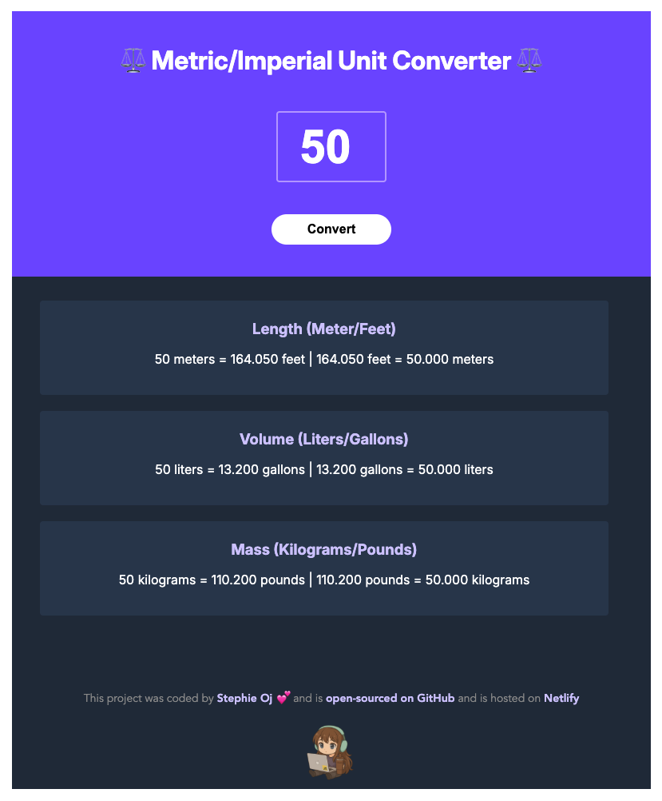

# ⚖️ Metric/Imperial Unit Converter

---

## 🌐 Live Demo

---

## 🧩 Requirements from the course
- Follow the provided **design spec (Figma)**  
- Generate all conversions when the user clicks **“Convert”**  
- Round the numbers down to **three decimal places**  
- Reinforce **JavaScript fundamentals** with clean, reusable functions  

---

## 🧠 What I learned
Through this project I practiced and reinforced:
- Creating **pure functions** for mathematical conversions  
- Using **objects as return values** to organize multiple results  
- Passing data through **parameters** and managing **function scope**  
- Updating the DOM dynamically using **`textContent`** (instead of `innerHTML`)  
- Structuring and styling with **clean, consistent CSS**  
- Improving **HTML accessibility** with semantic tags and ARIA labels  
- Replacing Vite setup with a **simple static deployment** for easier hosting  

---

## 🛠️ Technologies Used
- HTML  
- CSS  
- JavaScript  

---

## ⚙️ Features
- ✅ Converts **Length (Meters ↔ Feet)**  
- ✅ Converts **Volume (Liters ↔ Gallons)**  
- ✅ Converts **Mass (Kilograms ↔ Pounds)**  
- ✅ All conversions trigger with one button click  
- ✅ Numbers rounded to three decimal places  
- ✅ Accessible input field for screen readers (`label`, `aria-label`, `type="number"`)  
- ✅ Fully responsive

---

## ⚙️ Getting Started

To run this project locally:

1. Clone the repository  
2. Open `index.html` in your browser  
   *(or use a Live Server extension)*

---

## 💬 Feedback

I’m always improving as a developer — any tips, feedback, or code suggestions are welcome! 🌱

---

## 💜 Happy Coding!

Committed to learning fundamentals deeply and building strong foundations — one project at a time.

---

## 👩🏼‍💻 Author

**Stephie Oj**  
Aspiring Fullstack Developer | Learning in public ✨

